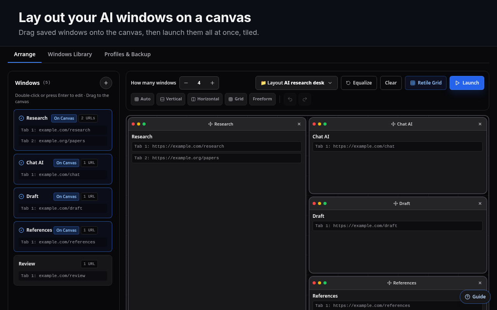
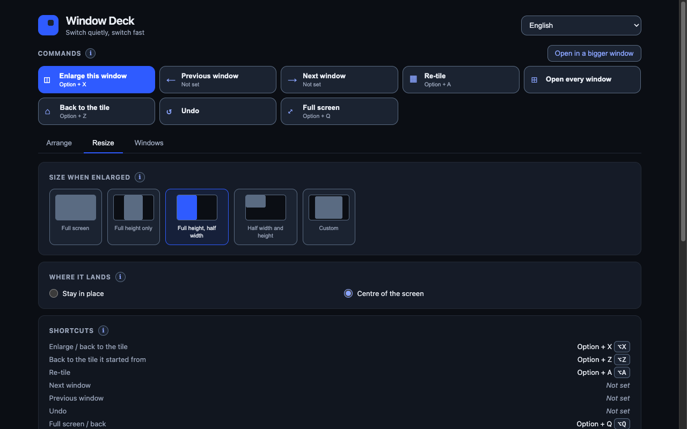
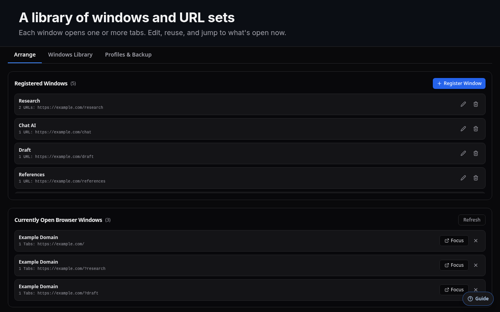
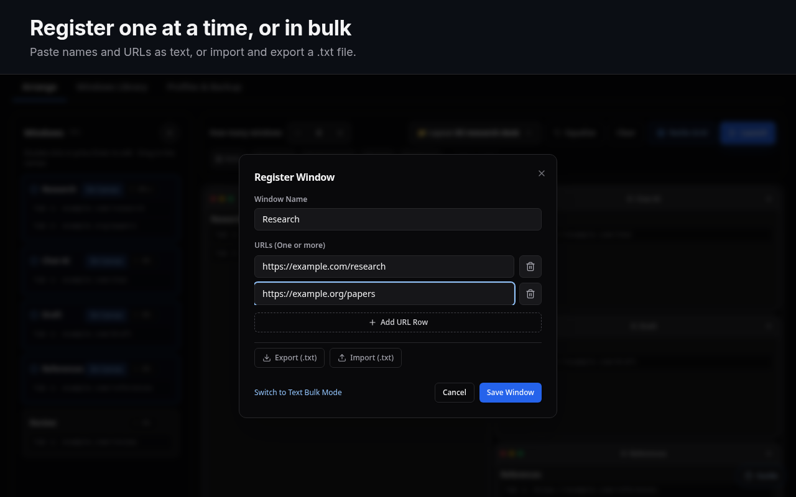

[English](README.md) | [日本語](README.ja.md) | [Deutsch](README.de.md) | **Español** | [Français](README.fr.md) | [한국어](README.ko.md) | [Português (BR)](README.pt_BR.md) | [简体中文](README.zh_CN.md)

# AI Window Deck

Gestor de ventanas para Claude Code en la nube y Codex: trabaja en varios proyectos a la vez sin perderte.

Una extensión de Chrome para quienes trabajan con varias herramientas de IA y referencias a la vez. Guarda las ventanas que usas juntas, colócalas en un lienzo, ábrelas todas de una vez como ventanas de Chrome en mosaico y destaca una de ellas con un solo atajo.

Tu perfil de Chrome, tus sesiones iniciadas, tu gestor de contraseñas y tus demás extensiones siguen como están. AI Window Deck solo organiza ventanas normales de Chrome.



## Funciones

- **Biblioteca de ventanas.** Cada ventana guardada tiene un nombre y una o varias URL, que se abren como pestañas. Puedes añadir ventanas de una en una, pegarlas en bloque como texto o importar y exportar un archivo `.txt`.
- **Lienzo de diseño.** Arrastra ventanas a un lienzo de 12 × 12 y cambia su tamaño desde cualquier borde. Los diseños disponibles son Auto, Vertical, Horizontal, Cuadrícula, Enfoque (una ventana grande) y Libre. El lienzo permite deshacer y rehacer, y puedes guardar varios diseños predefinidos (A, B, …).
- **Abrir y reorganizar.** Con un clic se abren todas las ventanas del diseño y se colocan en mosaico en la(s) pantalla(s) que elegiste, con sus pestañas agrupadas. *Reorganizar cuadrícula* devuelve a su sitio las ventanas que ya abriste.
- **Spotlight.** `Alt+X` amplía la ventana activa: mitad, alto completo con mitad de ancho, tres cuartos, solo alto completo, pantalla completa o un tamaño personalizado. Tú decides si se amplía desde su posición actual o desde el centro de la pantalla. Pulsa `Alt+X` de nuevo, o `Alt+Z`, para devolverla a su posición en el mosaico.
- **Moverse entre ventanas.** Ve a la ventana anterior o siguiente, enfoca las ventanas 1–8, deshaz la última organización y activa o desactiva la pantalla completa.
- **Varias pantallas.** Elige en qué monitor o monitores se abre el deck.
- **Controlador flotante y ventana grande.** Mantén abierto un controlador compacto o abre la configuración en una ventana propia.
- **Copia de seguridad.** Haz una copia de seguridad de todas las ventanas, diseños y ajustes en un archivo JSON, o restáuralos.
- **8 idiomas.** English, 日本語, Deutsch, Español, Français, 한국어, Português (Brasil) y 简体中文. El panel sigue el idioma del navegador hasta que eliges uno.

| Spotlight | Biblioteca de ventanas | Registrar ventanas |
| --- | --- | --- |
|  |  |  |

## Instalación

### Chrome Web Store

Instálala desde la [Chrome Web Store](https://chromewebstore.google.com/detail/ai-window-deck/hnadegmlbljffcogkclppfdcaiijjcgc).

### Desde un ZIP de una versión publicada

1. Descarga `AI-Window-Deck-vX.Y.Z.zip` desde [Releases](https://github.com/takaoumehara/ai-window-deck/releases) y descomprímelo.
2. Abre `chrome://extensions` y activa el **Modo de desarrollador**.
3. Haz clic en **Cargar descomprimida** y selecciona la carpeta descomprimida.

### Desde el código fuente

```sh
git clone https://github.com/takaoumehara/ai-window-deck.git
cd ai-window-deck
npm install
npm run build
```

Después, carga la carpeta del repositorio (la que contiene `manifest.json`) con **Cargar descomprimida**. `dist/` está incluido en el repositorio, así que cargar un clon recién descargado también funciona sin compilar.

## Uso

1. Haz clic en el icono de la barra de herramientas. La primera vez, una breve guía señala los tres pasos.
2. **Elige una pantalla** en *Seleccionar pantalla(s) de destino*.
3. **Registra ventanas** con **+** en la barra lateral *Ventanas*: un nombre y una o varias URL.
4. **Arrastra ventanas al lienzo.** Indica cuántas ventanas quieres, elige un diseño y cambia el tamaño de los mosaicos desde sus bordes.
5. Haz clic en **Abrir**. Cada ventana se abre en su propia ventana de Chrome, en mosaico según el lienzo.
6. Usa los atajos de Spotlight y de navegación mientras trabajas.

Consejos:

- En la barra lateral, haz doble clic en una tarjeta de ventana o pulsa `Enter` sobre ella para editarla. `Delete` la elimina.
- Los cuadros de diálogo se cierran con `Escape`, y el foco del teclado vuelve al botón que los abrió.
- *Abrir en ventana grande* abre el mismo panel con un tamaño más amplio que la ventana emergente de la barra de herramientas.

### Atajos de teclado

| Comando | Predeterminado |
| --- | --- |
| Spotlight: ampliar la ventana activa / devolverla a su mosaico | `Alt+X` |
| Devolver la ventana al mosaico en el que empezó | `Alt+Z` |
| Organizar (reorganizar en mosaico) las ventanas del deck | `Alt+A` |
| Pantalla completa / volver | `Alt+Q` |
| Deshacer la última organización | sin asignar |
| Ventana siguiente / ventana anterior | sin asignar |
| Enfocar las ventanas 1–8 | sin asignar |

Chrome solo permite que una extensión sugiera cuatro atajos predeterminados. Puedes asignar o cambiar cualquiera de ellos en `chrome://extensions/shortcuts`; el enlace *Cambiar combinaciones* del panel abre esa página. En macOS, Chrome muestra `Alt` como `⌥`.

## Permisos y privacidad

| Permiso | Por qué es necesario |
| --- | --- |
| `tabs` | Abrir las URL guardadas como pestañas y leer los títulos y las URL de las ventanas abiertas para mostrarlas en una lista y organizarlas. |
| `tabGroups` | Poner nombre y color al grupo de pestañas de cada ventana que abre el deck. |
| `storage` | Guardar tus ventanas, diseños y preferencias. |
| `system.display` | Leer el tamaño y la posición de las pantallas para colocar las ventanas en el monitor correcto. |

AI Window Deck no tiene permisos de host ni scripts de contenido, y no lee el contenido de las páginas. No realiza solicitudes de red ni carga código remoto. No hay analíticas ni cuentas. La configuración se guarda con `chrome.storage.sync`, de modo que Chrome puede sincronizarla entre tus propios dispositivos si tienes activada la sincronización de Chrome. El estado temporal para deshacer se guarda en `chrome.storage.session`. No se envía nada al desarrollador ni a terceros.

La política completa está en [PRIVACY.md](PRIVACY.md).

## Desarrollo

Requiere Node.js 20+ y Python 3.

```sh
npm install           # dependencies
npm run build         # build the React panel into dist/
npm test              # unit tests (node --test)
npm run dev           # Vite dev server for the panel (no chrome.* APIs)
./tools/package.sh    # build, validate and zip AI-Window-Deck-v<version>.zip
```

Estructura del repositorio:

| Ruta | Contenido |
| --- | --- |
| `manifest.json`, `background.js` | Manifiesto de la extensión y service worker (colocación de ventanas, atajos) |
| `src/` | Panel en React + Tailwind que usan la ventana emergente y la página de opciones |
| `dist/` | Panel compilado. Se incluye en el repositorio para que este pueda cargarse descomprimido tal cual |
| `identify.html`, `identify.js` | El número que aparece brevemente en una pantalla al identificarla |
| `_locales/`, `tools/strings.json`, `tools/ui-strings.json` | Traducciones (ver más abajo) |
| `tools/` | Compilación de i18n, empaquetado y validación del paquete |
| `store-assets/` | Textos de la ficha de Chrome Web Store, capturas de pantalla, mosaicos promocionales y script de captura |
| `test/` | Pruebas unitarias |

`deck.html`, `deck.js`, `dock.html` y `dock.js` son el panel anterior a la versión 1.7. Se conservan como referencia y no se incluyen en el paquete.

### Traducciones

Los textos del panel están en `tools/ui-strings.json`. Los textos propios de Chrome (la descripción de la extensión y los nombres de los atajos) están en `tools/strings.json`. Después de editar cualquiera de los dos archivos, ejecuta:

```sh
python3 tools/build-i18n.py
```

Esto vuelve a generar `src/lib/ui-strings.js` y `_locales/*/messages.json`. La compilación falla si a algún idioma del panel le falta una clave. `npm test` también comprueba que los marcadores de posición coincidan en todos los idiomas.

## Proceso de publicación

1. Incrementa `version` en `manifest.json` y `package.json`, y actualiza `CHANGELOG.md`.
2. Ejecuta `npm test` y `./tools/package.sh`. El script valida el ZIP: los archivos referenciados, las claves `__MSG_` en todos los idiomas y la longitud de la descripción.
3. Sube el ZIP al panel de Chrome Web Store.
4. Cuando la tienda apruebe la versión, crea la etiqueta `vX.Y.Z` en `main` y adjunta el ZIP a una GitHub Release.

Consulta [docs/RELEASING.md](docs/RELEASING.md) para más detalles.

## Soporte

Informa de errores y envía sugerencias en [GitHub Issues](https://github.com/takaoumehara/ai-window-deck/issues).

## Licencia

[MIT](LICENSE) © 2026 Takao Umehara
