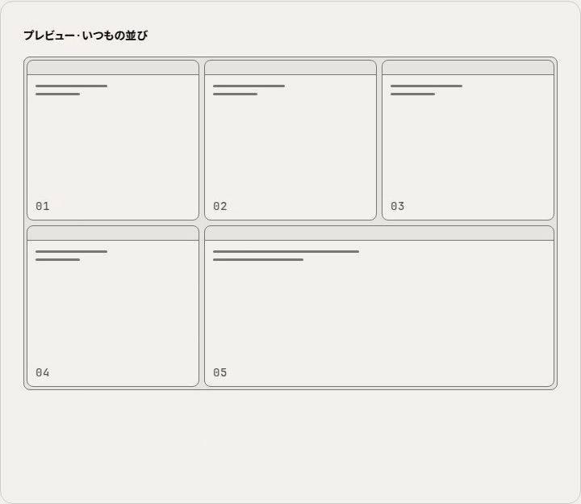

[English](README.md) | **日本語** | [Deutsch](README.de.md) | [Español](README.es.md) | [Français](README.fr.md) | [한국어](README.ko.md) | [Português (BR)](README.pt_BR.md) | [简体中文](README.zh_CN.md)

# AI Window Deck

[](https://ko-fi.com/G2G71VP1DF)

**クラウドのセッションを並べて、考える余白を。**

複数の AI ツールや資料を並べて作業する人のための Chrome 拡張機能です。一緒に使うウィンドウを保存してキャンバス上に配置し、タイル状に並んだ Chrome ウィンドウとして一度に開けます。さらに、ショートカット 1 つでそのうちの 1 つを拡大（Spotlight）できます。

Chrome のプロファイル、ログイン状態、パスワードマネージャー、その他の拡張機能はそのまま使えます。AI Window Deck は通常の Chrome ウィンドウを並べるだけです。

<p align="center">
  <picture>
    <source media="(prefers-color-scheme: dark)" srcset="docs/images/focus-preview-ja-dark.gif">
    
  </picture>
</p>

Web サイト: <https://ai-window-deck.vercel.app/>

## 使い方の流れ

| **① URL を登録** | **② 配置** |
| --- | --- |
|  |  |
| ウィンドウごとに名前と URL を保存。各 URL はタブとして開きます。 | キャンバスにウィンドウを配置し、グリッドの枠を調整します。 |
| **③ フォーカス表示** | **④ 起動** |
|  |  |
| 拡大サイズと基準位置を選択。「今の場所から拡大」または「中央に寄せる」。 | ディスプレイを選び、保存した配置で Chrome ウィンドウを開きます。 |

## 機能

- **ウィンドウライブラリ。** 保存した各ウィンドウには名前と 1 つ以上の URL があり、URL はタブとして開きます。ウィンドウは 1 つずつ追加するほか、テキストでまとめて貼り付けたり、`.txt` ファイルでインポート・エクスポートしたりできます。
- **レイアウトキャンバス。** 12 × 12 のキャンバスにウィンドウをドラッグし、どの辺からでもサイズを変更できます。レイアウトは「自動」「縦割り」「横割り」「グリッド」「主役」（1 つを大きく表示）「自由」から選べます。キャンバスでは取り消しとやり直しができ、複数のレイアウトプリセット（A、B、…）を保持できます。
- **起動と並べ直し。** クリック 1 回でレイアウト内のすべてのウィンドウを開き、選んだディスプレイにタイル状に並べます。タブはグループにまとめられます。*並べ直す* を使うと、起動済みのウィンドウを元の位置に戻せます。
- **Spotlight。** `Alt+X` でアクティブなウィンドウを拡大します。サイズは半分、横半分・縦いっぱい、3/4、縦いっぱい、全画面、任意のサイズから選べます。現在の位置から広げるか、画面中央から広げるかも選択できます。もう一度 `Alt+X` を押すか `Alt+Z` を押すと、元のタイルに戻ります。
- **ウィンドウ間の移動。** 前後のウィンドウへの移動、ウィンドウ 1〜8 へのフォーカス、直前の配置の取り消し、全画面の切り替えができます。
- **マルチディスプレイ。** デッキを開くモニターを 1 台または複数台から選べます。
- **小窓コントローラーと大きいウィンドウ。** コンパクトなコントローラーを開いたままにしたり、設定を専用のウィンドウで開いたりできます。
- **バックアップ。** すべてのウィンドウ、レイアウト、設定を JSON ファイルでバックアップ・復元できます。
- **8 言語対応。** English、日本語、Deutsch、Español、Français、한국어、Português (Brasil)、简体中文に対応しています。言語を選ぶまでは、パネルはブラウザの言語に従います。

<p align="center"></p>
<p align="center"><em>今の場所から拡大 / 中央に寄せる — ステップ ③ で基準位置を選択。</em></p>

## インストール

### Chrome ウェブストア

[Chrome ウェブストア](https://chromewebstore.google.com/detail/ai-window-deck/hnadegmlbljffcogkclppfdcaiijjcgc)からインストールできます。

### リリース ZIP から

1. [Releases](https://github.com/takaoumehara/ai-window-deck/releases) から `AI-Window-Deck-vX.Y.Z.zip` をダウンロードして解凍します。
2. `chrome://extensions` を開き、**デベロッパー モード**をオンにします。
3. **パッケージ化されていない拡張機能を読み込む**をクリックし、解凍したフォルダを選択します。

### ソースから

```sh
git clone https://github.com/takaoumehara/ai-window-deck.git
cd ai-window-deck
npm install
npm run build
```

その後、リポジトリのフォルダ（`manifest.json` を含むフォルダ）を **パッケージ化されていない拡張機能を読み込む** で読み込みます。`dist/` はコミットされているため、クローンしたばかりのリポジトリをビルドせずに読み込むこともできます。

## 使い方

1. ツールバーのアイコンをクリックします。初回起動時には、3 つのステップを示す短いガイドが表示されます。
2. *配置対象のモニターを選択* で **開くモニターを選びます**。
3. *Windows* サイドバーの **+** で **ウィンドウを登録します**。名前と 1 つ以上の URL を入力します。
4. **ウィンドウをキャンバスにドラッグします。** ウィンドウの数を設定してレイアウトを選び、タイルの辺をドラッグしてサイズを調整します。
5. **起動** をクリックします。各ウィンドウがそれぞれ独立した Chrome ウィンドウとして開き、キャンバスどおりにタイル状に並びます。
6. 作業中は Spotlight とナビゲーションのショートカットを活用してください。

ヒント:

- サイドバーでウィンドウカードをダブルクリックするか、カードを選んで `Enter` を押すと編集できます。`Delete` で削除します。
- ダイアログは `Escape` で閉じ、キーボードフォーカスはダイアログを開いたボタンに戻ります。
- *大きいウィンドウで開く* を使うと、ツールバーのポップアップより広いサイズで同じパネルを開けます。

### キーボードショートカット

| コマンド | デフォルト |
| --- | --- |
| Spotlight: アクティブなウィンドウを拡大 / タイルに戻す | `Alt+X` |
| ウィンドウを最初のタイルに戻す | `Alt+Z` |
| デッキのウィンドウを並べる（並べ直す） | `Alt+A` |
| 全画面 / 戻す | `Alt+Q` |
| 直前の配置を取り消す | 未設定 |
| 次のウィンドウ / 前のウィンドウ | 未設定 |
| ウィンドウ 1〜8 にフォーカス | 未設定 |

Chrome では、拡張機能が提案できるデフォルトのショートカットは 4 つまでです。どのショートカットも `chrome://extensions/shortcuts` で割り当てや変更ができます。パネルの *ショートカットを変更* リンクからこのページを開けます。macOS では、Chrome は `Alt` を `⌥` と表示します。

## 権限とプライバシー

| 権限 | 必要な理由 |
| --- | --- |
| `tabs` | 保存した URL をタブとして開くため、また、開いているウィンドウのタイトルと URL を読み取って一覧表示し、配置するため。 |
| `tabGroups` | デッキが開く各ウィンドウのタブグループに名前と色を付けるため。 |
| `storage` | ウィンドウ、レイアウト、各種設定を保存するため。 |
| `system.display` | ディスプレイのサイズと位置を読み取り、正しいモニターにウィンドウを並べるため。 |

AI Window Deck はホスト権限やコンテンツスクリプトを持たず、ページの内容を読み取りません。ネットワークリクエストを送信せず、リモートコードも読み込みません。アナリティクスやアカウントもありません。設定は `chrome.storage.sync` に保存されるため、Chrome 同期をオンにしている場合は、Chrome がご自身のデバイス間で設定を同期できます。取り消し用の一時的な状態は `chrome.storage.session` に保持されます。開発者や第三者に送信されるデータは一切ありません。

ポリシーの全文は [PRIVACY.md](PRIVACY.md) をご覧ください。

## 開発

Node.js 20 以上と Python 3 が必要です。

```sh
npm install           # dependencies
npm run build         # build the React panel into dist/
npm test              # unit tests (node --test)
npm run dev           # Vite dev server for the panel (no chrome.* APIs)
./tools/package.sh    # build, validate and zip AI-Window-Deck-v<version>.zip
```

リポジトリの構成:

| パス | 内容 |
| --- | --- |
| `manifest.json`, `background.js` | 拡張機能のマニフェストとサービスワーカー（ウィンドウの配置、ショートカット） |
| `src/` | ポップアップとオプションページで使用する React + Tailwind のパネル |
| `dist/` | ビルド済みのパネル。リポジトリをそのまま「パッケージ化されていない拡張機能」として読み込めるよう、コミットされています |
| `identify.html`, `identify.js` | ディスプレイを識別する際に、そのディスプレイに一時的に表示される番号 |
| `_locales/`, `tools/strings.json`, `tools/ui-strings.json` | 翻訳（後述） |
| `tools/` | i18n のビルド、パッケージ化、パッケージの検証 |
| `store-assets/` | Chrome ウェブストアの掲載文、スクリーンショット、プロモーションタイル、キャプチャスクリプト |
| `test/` | ユニットテスト |

`deck.html`、`deck.js`、`dock.html`、`dock.js` は 1.7 より前のパネルです。参照用に残していますが、パッケージには含まれません。

### 翻訳

パネルの文字列は `tools/ui-strings.json` にあります。Chrome 自体が使う文字列（拡張機能の説明とショートカット名）は `tools/strings.json` にあります。いずれかのファイルを編集したら、次のコマンドを実行してください。

```sh
python3 tools/build-i18n.py
```

これにより `src/lib/ui-strings.js` と `_locales/*/messages.json` が再生成されます。パネルのいずれかのロケールでキーが欠けていると、ビルドは失敗します。`npm test` でも、すべての言語でプレースホルダーが一致しているかをチェックします。

## リリース手順

1. `manifest.json` と `package.json` の `version` を上げ、`CHANGELOG.md` を更新します。
2. `npm test` と `./tools/package.sh` を実行します。このスクリプトは ZIP を検証します（参照されているファイル、すべてのロケールの `__MSG_` キー、説明文の長さ）。
3. ZIP を Chrome ウェブストアのダッシュボードにアップロードします。
4. ストアでそのバージョンが承認されたら、`main` に `vX.Y.Z` タグを付け、GitHub Release に ZIP を添付します。

詳しくは [docs/RELEASING.md](docs/RELEASING.md) をご覧ください。

## サポート

バグの報告やご提案は [GitHub Issues](https://github.com/takaoumehara/ai-window-deck/issues) までお寄せください。

AI Window Deck が日々の作業に役立ったら、[Ko-fi](https://ko-fi.com/G2G71VP1DF) で開発を応援できます。

[](https://ko-fi.com/G2G71VP1DF)

## ライセンス

[MIT](LICENSE) © 2026 Takao Umehara
