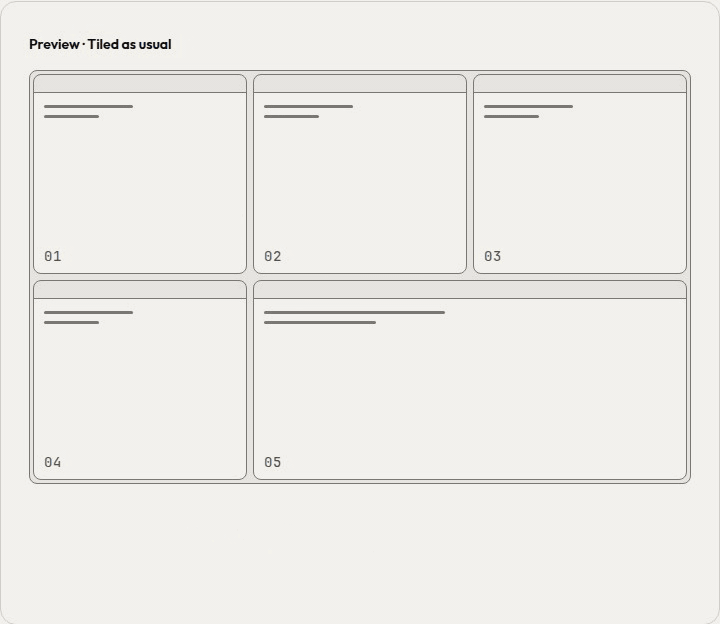
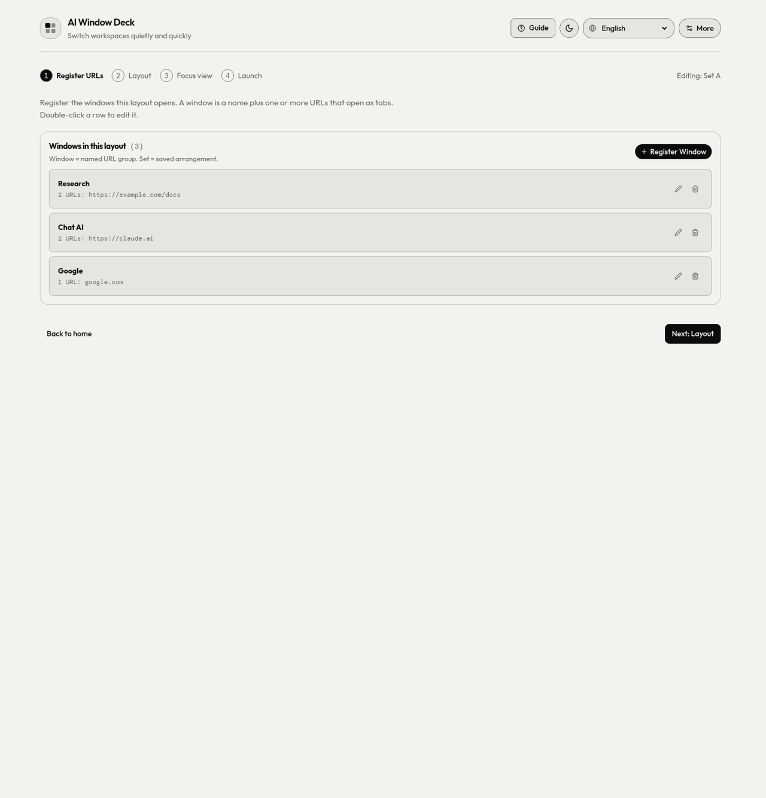
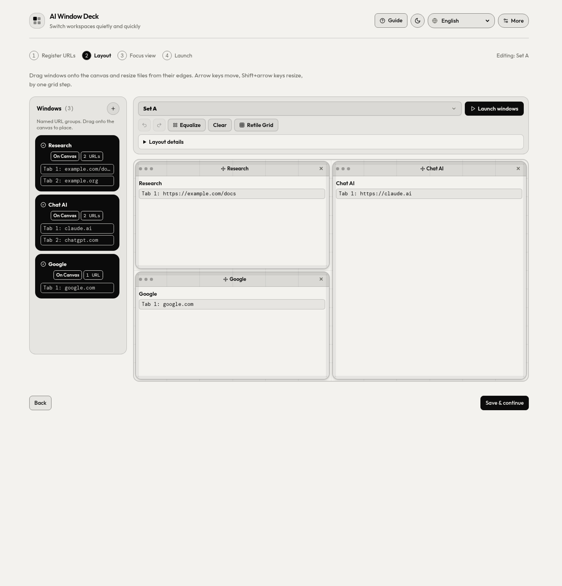
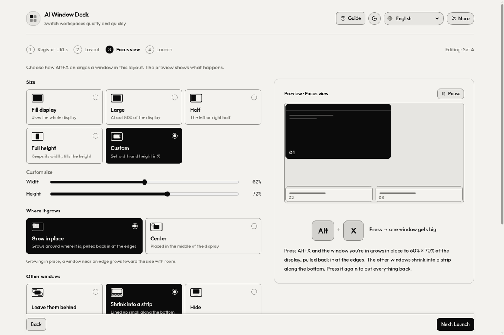
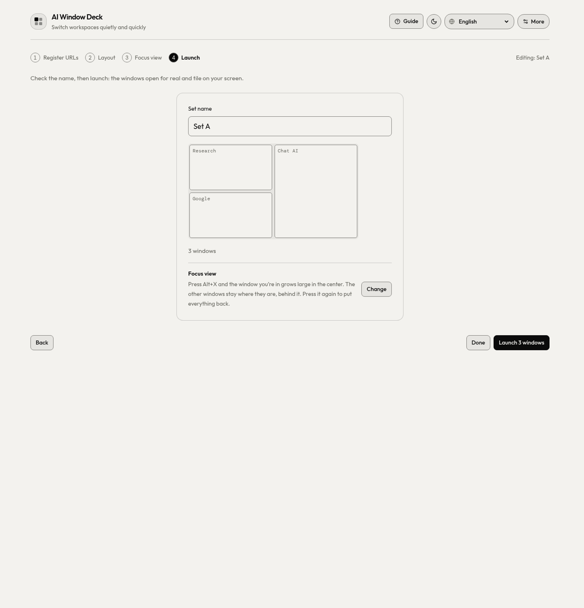
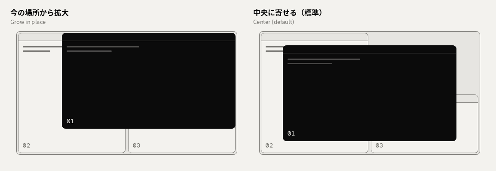

**English** | [日本語](README.ja.md) | [Deutsch](README.de.md) | [Español](README.es.md) | [Français](README.fr.md) | [한국어](README.ko.md) | [Português (BR)](README.pt_BR.md) | [简体中文](README.zh_CN.md)

# AI Window Deck

[](https://ko-fi.com/G2G71VP1DF)

**More cloud sessions. Room to think.**

Window manager for Claude Code in the cloud and Codex — run multiple projects at once without getting confused.

A Chrome extension for people who work with several AI tools and references side by side. Save the windows you use together, lay them out on a canvas, open them all at once as tiled Chrome windows, and spotlight one of them with a single shortcut.

Your Chrome profile, sign-ins, password manager and other extensions stay as they are. AI Window Deck only arranges ordinary Chrome windows.

<p align="center">
  <picture>
    <source media="(prefers-color-scheme: dark)" srcset="docs/images/focus-preview-en-dark.gif">
    
  </picture>
</p>

Website: <https://ai-window-deck.vercel.app/>

## How it works

| **① Register URLs** | **② Layout** |
| --- | --- |
|  |  |
| Save a name and URLs for each window. Each URL opens as a tab. | Place windows on the canvas and resize their grid slots. |
| **③ Focus view** | **④ Launch** |
|  |  |
| Choose an enlargement size and origin: grow in place or center. | Choose your displays and open the saved layout as Chrome windows. |

## Features

- **Window library.** Each saved window has a name and one or more URLs, which open as tabs. You can add windows one at a time, paste them in bulk as text, or import and export a `.txt` file.
- **Layout canvas.** Drag windows onto a 12 × 12 canvas and resize them from any edge. Layouts include Auto, Vertical, Horizontal, Grid, Focus (one large window) and Freeform. The canvas has undo and redo, and you can keep several layout presets (A, B, …).
- **Launch and re-tile.** One click opens every window in the layout and tiles it on the display(s) you chose, with its tabs grouped. *Retile* moves windows you already launched back into place.
- **Spotlight.** `Alt+X` enlarges the active window: half, tall, three quarters, full height, full screen or a custom size. You choose whether it grows from where it is or from the screen centre. Press `Alt+X` again, or `Alt+Z`, to put it back in its tile.
- **Move between windows.** Go to the previous or next window, focus window 1–8, undo the last arrangement, and toggle full screen.
- **Multiple displays.** Choose which monitor or monitors the deck opens on.
- **Floating controller and large window.** Keep a compact controller open, or open the settings in a window of their own.
- **Backup.** Back up or restore all windows, layouts and settings as a JSON file.
- **8 languages.** English, 日本語, Deutsch, Español, Français, 한국어, Português (Brasil) and 简体中文. The panel follows the browser language until you pick one.

<p align="center"></p>
<p align="center"><em>Grow in place / Center — choose the origin in step ③.</em></p>

## Install

### Chrome Web Store

Install from the [Chrome Web Store](https://chromewebstore.google.com/detail/ai-window-deck/hnadegmlbljffcogkclppfdcaiijjcgc).

### From a release ZIP

1. Download `AI-Window-Deck-vX.Y.Z.zip` from [Releases](https://github.com/takaoumehara/ai-window-deck/releases) and unzip it.
2. Open `chrome://extensions` and turn on **Developer mode**.
3. Click **Load unpacked** and select the unzipped folder.

### From source

```sh
git clone https://github.com/takaoumehara/ai-window-deck.git
cd ai-window-deck
npm install
npm run build
```

Then load the repository folder (the one that contains `manifest.json`) with **Load unpacked**. `dist/` is committed, so loading a fresh clone also works without building.

## Usage

1. Click the toolbar icon. On first run, a short guide marks the three steps.
2. **Choose a display** under *Select Target Display(s)*.
3. **Register windows** with **+** in the *Windows* sidebar: a name, plus one or more URLs.
4. **Drag windows onto the canvas.** Set how many windows you want, pick a layout, and resize tiles from their edges.
5. Click **Launch**. Each window opens in its own Chrome window, tiled to match the canvas.
6. Use the spotlight and navigation shortcuts while you work.

Tips:

- In the sidebar, double-click a window card or press `Enter` on it to edit it. `Delete` removes it.
- Dialogs close with `Escape`, and keyboard focus returns to the button that opened them.
- *Open in Large Window* opens the same panel at a roomier size than the toolbar popup.

### Keyboard shortcuts

| Command | Default |
| --- | --- |
| Spotlight: enlarge the active window / back to its tile | `Alt+X` |
| Put the window back in the tile it started from | `Alt+Z` |
| Arrange (re-tile) the deck windows | `Alt+A` |
| Full screen / back | `Alt+Q` |
| Undo the last arrangement | not set |
| Next window / previous window | not set |
| Focus window 1–8 | not set |

Chrome lets an extension suggest only four default shortcuts. You can assign or change any of them at `chrome://extensions/shortcuts`; the panel's *Change shortcuts* link opens that page. On macOS, Chrome shows `Alt` as `⌥`.

## Permissions and privacy

| Permission | Why it is needed |
| --- | --- |
| `tabs` | Open saved URLs as tabs, and read the titles and URLs of open windows to list them and arrange them. |
| `tabGroups` | Name and colour the tab group of each window the deck opens. |
| `storage` | Save your windows, layouts and preferences. |
| `system.display` | Read display sizes and positions so windows are tiled on the right monitor. |

AI Window Deck has no host permissions or content scripts, and does not read page content. It makes no network requests and loads no remote code. There are no analytics and no accounts. Settings are stored with `chrome.storage.sync`, so Chrome can sync them between your own devices if you have Chrome Sync on. Temporary undo state is kept in `chrome.storage.session`. Nothing is sent to the developer or to third parties.

The full policy is in [PRIVACY.md](PRIVACY.md).

## Development

Requires Node.js 20+ and Python 3.

```sh
npm install           # dependencies
npm run build         # build the React panel into dist/
npm test              # unit tests (node --test)
npm run dev           # Vite dev server for the panel (no chrome.* APIs)
./tools/package.sh    # build, validate and zip AI-Window-Deck-v<version>.zip
```

Repository layout:

| Path | Contents |
| --- | --- |
| `manifest.json`, `background.js` | Extension manifest and service worker (window placement, shortcuts) |
| `src/` | React + Tailwind panel used by the popup and the options page |
| `dist/` | Built panel. It is committed so the repository loads unpacked as-is |
| `identify.html`, `identify.js` | The number briefly shown on a display when you identify it |
| `_locales/`, `tools/strings.json`, `tools/ui-strings.json` | Translations (see below) |
| `tools/` | i18n build, packaging, package validation |
| `store-assets/` | Chrome Web Store listing copy, screenshots, promo tiles and capture script |
| `test/` | Unit tests |

`deck.html`, `deck.js`, `dock.html` and `dock.js` are the pre-1.7 panel. They are kept for reference and are not packaged.

### Translations

The panel strings live in `tools/ui-strings.json`. Chrome's own strings (extension description and shortcut names) live in `tools/strings.json`. After editing either file, run:

```sh
python3 tools/build-i18n.py
```

This regenerates `src/lib/ui-strings.js` and `_locales/*/messages.json`. The build fails if a panel locale is missing a key. `npm test` also checks that placeholders match in every language.

## Release process

1. Bump `version` in `manifest.json` and `package.json`, and update `CHANGELOG.md`.
2. Run `npm test` and `./tools/package.sh`. The script validates the ZIP: referenced files, `__MSG_` keys in every locale, and description length.
3. Upload the ZIP to the Chrome Web Store dashboard.
4. After the store approves the version, tag `vX.Y.Z` on `main` and attach the ZIP to a GitHub Release.

See [docs/RELEASING.md](docs/RELEASING.md) for details.

## Support

Report bugs and suggestions on [GitHub Issues](https://github.com/takaoumehara/ai-window-deck/issues).

If AI Window Deck helps your day, you can support its development on [Ko-fi](https://ko-fi.com/G2G71VP1DF).

[](https://ko-fi.com/G2G71VP1DF)

## License

[MIT](LICENSE) © 2026 Takao Umehara
